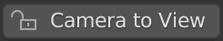
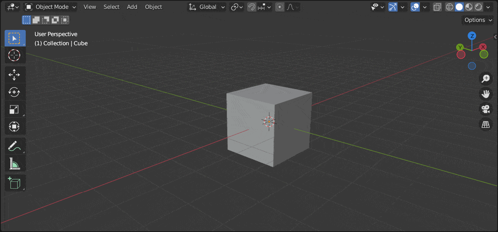

# Easy Camera to View

Blender 3.2 Add-on to create a Camera to View button and easily lock or unlock the view

## Download

v 0.1.0

## Changelog

[CHANGELOG.md](https://github.com/claromes/easy_camera_to_view/blob/main/CHANGELOG.md)

## Development

- `main`

Realesed version

- `header`

Development of version with 3D View Header button (current version)

- `3dview`

First idea using [`gpu module`](https://docs.blender.org/api/current/gpu.html) and under development. A floating 3D View button

## Feedbacks and Contributing Are Welcome!

Send me feedbacks via issue or [tweet](https://twitter.com/claromes)