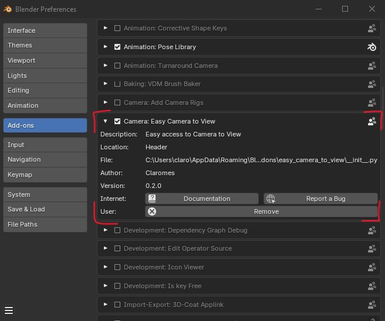
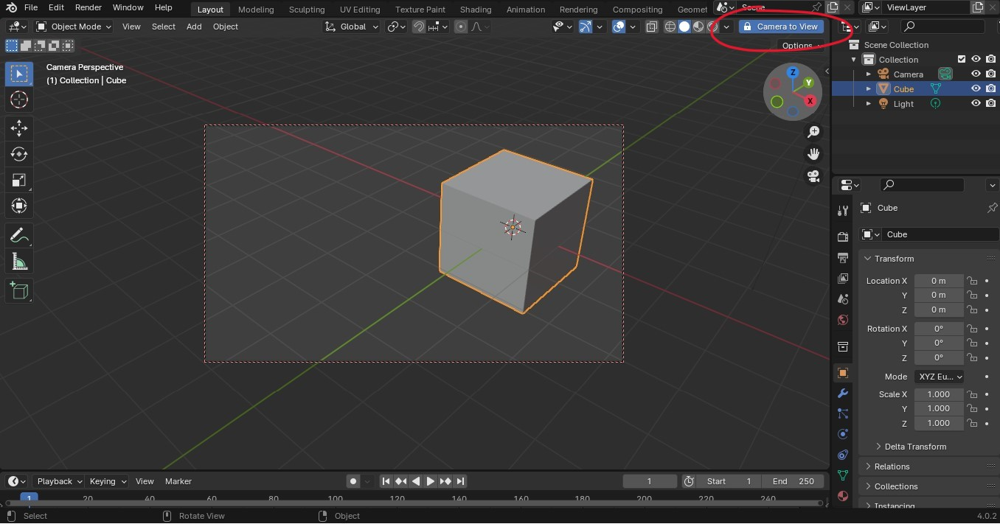
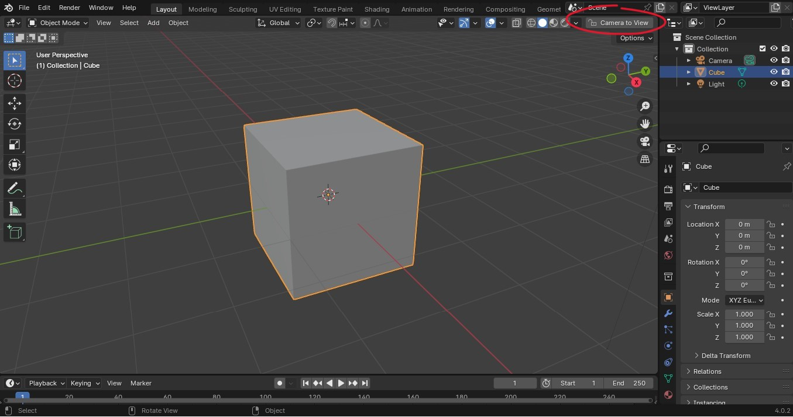

# Easy Camera to View

Blender Add-on to create a Camera to View button on Header region and easily lock or unlock the view

## Installation

- Download the [easy_camera_to_view_v02.zip](https://github.com/claromes/easy_camera_to_view/releases/tag/v0.2) file
- Open the Blender User Preferences and select the Add-ons tab
- Click "Install..." button and select the easy_camera_to_view_v02.zip file
- Click the checkbox to enable the add-on "Camera: Easy Camera to View"

## Screenshots

User Preferences:

Locked

Unlocked:

Demo video:

## Development Branches

- `main`

    Released and maintaining version

- `3dview`

    A floating 3D View button. First idea, using gpu module and no longer in development, only for references.

## Author

[Claromes](https://claromes.com)